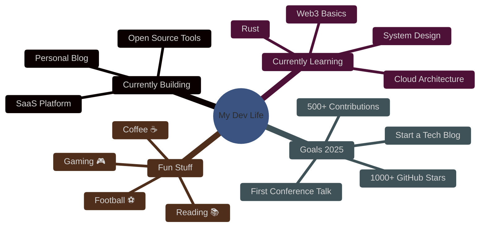

<div align="center">

<!-- Animated Banner -->


<!-- Typing SVG -->
<a href="https://git.io/typing-svg">
  
</a>

<!-- Social Badges -->
<a href="https://linkedin.com/in/YOUR_LINKEDIN" target="_blank">
  
</a>
<a href="https://twitter.com/YOUR_TWITTER" target="_blank">
  
</a>
<a href="mailto:ntgi46@proton.me" target="_blank">
  
</a>
<a href="https://yourportfolio.com" target="_blank">
  
</a>
<a href="https://discord.gg/YOUR_DISCORD" target="_blank">
  
</a>

</div>

---

##  About Me

<table>
<tr>
<td width="60%">

```python
class Developer:
    def __init__(self):
        self.name = "smart-unknown"
        self.role = "Full Stack Developer"
        self.location = "📍 Egypt"
        self.languages = ["Arabic", "English"]
        self.education = "CS Graduate"

    def current_focus(self):
        return [
            "Building scalable web apps",
            "Learning system design",
            "Contributing to open source",
            "Creating useful tools"
        ]

    def fun_fact(self):
        return "I debug with console.log() and I'm proud of it 😎"
```

</td>
<td width="40%" align="center">

<!-- 3D Avatar -->


</td>
</tr>
</table>

---

##  Tech Stack

### 🖥️ Languages


### ⚡ Frontend


### 🛠️ Backend


### 🗄️ Database & Cloud


### 🛠️ Tools


---

##  GitHub Analytics

<div align="center">

<!-- GitHub Stats -->


<!-- Streak Stats -->


<!-- Top Languages -->


</div>

<div align="center">

<!-- Activity Graph -->


</div>

<!-- GitHub Profile Trophy -->
<div align="center">

</div>

---

## 🏗️ Featured Projects

<!-- Project Card 1 -->
<table>
<tr>
<td width="50%">

<a href="https://github.com/smart-unknown/project-1" target="_blank">
  <div align="center">
    
    <h3>🚀 Project Name 1</h3>
    <p>A full-stack e-commerce platform with real-time features, payment integration, and admin dashboard.</p>
    <div>
      
      
      
      
    </div>
    <br/>
    
    
    
  </div>
</a>

</td>
<td width="50%">

<a href="https://github.com/smart-unknown/project-2" target="_blank">
  <div align="center">
    
    <h3>💡 Project Name 2</h3>
    <p>An AI-powered chat application with real-time messaging, voice calls, and smart suggestions.</p>
    <div>
      
      
      
      
    </div>
    <br/>
    
    
    
  </div>
</a>

</td>
</tr>
</table>

<!-- Project Card 3 & 4 -->
<table>
<tr>
<td width="50%">

<a href="https://github.com/smart-unknown/project-3" target="_blank">
  <div align="center">
    
    <h3>🔧 Project Name 3</h3>
    <p>A CLI tool for automating development workflows with custom templates and deployment scripts.</p>
    <div>
      
      
      
    </div>
    <br/>
    
    
  </div>
</a>

</td>
<td width="50%">

<a href="https://github.com/smart-unknown/project-4" target="_blank">
  <div align="center">
    
    <h3>📱 Project Name 4</h3>
    <p>A cross-platform mobile app for habit tracking with gamification and social features.</p>
    <div>
      
      
      
    </div>
    <br/>
    
    
  </div>
</a>

</td>
</tr>
</table>

---

## 📊 What I'm Up To

<div align="center">



</div>

---

## 🎯 Current Focus & Goals

<table>
<tr>
<td>

### 🔥 What I'm Working On
- 🏗️ Building a SaaS product from scratch
- 📖 Deep diving into **System Design**
- 🤝 Contributing to open source projects
- 📝 Writing technical blog posts

### 📈 2025 Goals
| Goal | Progress |
|------|----------|
| 1000+ GitHub Stars | ████████░░ 80% |
| 500 Contributions | ██████░░░░ 60% |
| 10 Open Source PRs | ██████████ 100% |
| 5 Blog Posts | ████░░░░░░ 40% |
| Learn Rust | ██░░░░░░░░ 20% |

</td>
<td>

### 📚 Currently Reading
- 📖 *Designing Data-Intensive Applications*
- 📖 *Clean Architecture* by Robert C. Martin
- 📖 *The Pragmatic Programmer*

### 🎧 Dev Playlist
```
01. Lo-fi Hip Hop Radio
02. Ambient Electronic
03. Classical Piano
04. Rain Sounds + Thunder
05. Arabic Instrumental 🎵
```

### 💡 Quote of the Day
> *"First, solve the problem.  
> Then, write the code."*  
> — John Johnson

</td>
</tr>
</table>

---

## 🤝 Contribution Activity

<div align="center">

<!-- Isometric Commit Graph -->


</div>

---

##  Let's Connect!

<div align="center">

 **I'm always open to interesting conversations and collaborations!**

<br/><br/>

<a href="https://linkedin.com/in/YOUR_LINKEDIN">
  
</a>
<a href="https://twitter.com/YOUR_TWITTER">
  
</a>

<br/><br/>

<!-- Visitor Counter -->


<br/><br/>

<!-- Snake Eating Contributions -->


<br/>


</div>
```

---
