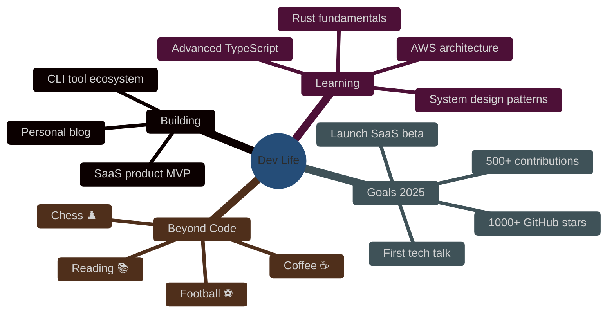

<div align="center">

<!-- Clean Header -->


<!-- Typing Effect -->
<a href="https://git.io/typing-svg">
  
</a>

<br/><br/>

<!-- Social Links -->
<a href="https://linkedin.com/in/YOUR_LINKEDIN" target="_blank"></a>
<a href="https://twitter.com/YOUR_TWITTER" target="_blank"></a>
<a href="https://github.com/smart-unknown" target="_blank"></a>
<a href="mailto:ntgi@proton.me" target="_blank"></a>
<a href="https://yourportfolio.com" target="_blank"></a>

<br/>


</div>

<br/>

---

### 👋 Who am I?

> A developer who cares about **craft** — not just shipping code, but building experiences that feel right. I spend my days writing clean, scalable software and my nights exploring new technologies. I believe great products live at the intersection of solid engineering and thoughtful design.

<br>

```python
from dataclasses import dataclass, field

@dataclass
class Ahmed:
    role: str = "Full Stack Developer"
    languages: list = field(default_factory=lambda: ["Arabic", "English"])

    def introduce(self):
        return f"Hi, I'm Ahmed — a {self.role} passionate about building scalable systems."

    def skills(self):
        return {
            "frontend": ["React", "Next.js"],
            "backend": ["Node.js", "GraphQL"],
            "database": ["PostgreSQL", "MongoDB"],
            "devops": ["Docker", "CI/CD"]
        }

    def mindset(self):
        return "Turning complex problems into elegant, scalable solutions"
```

<br>

---

### 🧰 What I Work With

<div align="center">

**Languages**
<br>


<br><br>

**Frontend**
<br>


<br><br>

**Backend**
<br>


<br><br>

**Database & Cloud**
<br>


<br><br>

**Tools I Use Daily**
<br>


</div>

<br>

---

### 🏗️ Featured Work

> Projects I'm proud of — each one taught me something new.

<br>

<table>
<tr>
<td width="50%" valign="top">

<a href="https://github.com/smart-unknown/project-1" target="_blank">
  <div align="center">
    
    <br><br>
    <b>🛒 E-Commerce Platform</b>
    <br>
    <sub>Full-stack store with real-time inventory, Stripe payments, and admin dashboard.</sub>
    <br><br>
    
    
    
    
    <br><br>
    
    
    
  </div>
</a>

</td>
<td width="50%" valign="top">

<a href="https://github.com/smart-unknown/project-2" target="_blank">
  <div align="center">
    
    <br><br>
    <b>💬 AI-Powered Chat</b>
    <br>
    <sub>Real-time messaging with smart suggestions, voice notes, and thread replies.</sub>
    <br><br>
    
    
    
    
    <br><br>
    
    
    
  </div>
</a>

</td>
</tr>
</table>

<table>
<tr>
<td width="50%" valign="top">

<a href="https://github.com/smart-unknown/project-3" target="_blank">
  <div align="center">
    
    <br><br>
    <b>⚡ DevFlow CLI</b>
    <br>
    <sub>Automate scaffolding, deployments, and dev workflows from the terminal.</sub>
    <br><br>
    
    
    
    <br><br>
    
    
  </div>
</a>

</td>
<td width="50%" valign="top">

<a href="https://github.com/smart-unknown/project-4" target="_blank">
  <div align="center">
    
    <br><br>
    <b>🎯 Habitly</b>
    <br>
    <sub>Cross-platform habit tracker with streaks, gamification, and social challenges.</sub>
    <br><br>
    
    
    
    <br><br>
    
    
  </div>
</a>

</td>
</tr>
</table>

<br>

---

### 📈 GitHub Activity

<div align="center">


&nbsp;


<br><br>


<br><br>


</div>

<br>

---

### 🗺️ What I'm Up To

<div align="center">



</div>

<br>

---

### 🎯 Goals Tracker

| Goal | Status | Progress |
|------|--------|----------|
| Reach 1,000 GitHub Stars | 🟡 In Progress | `████████░░` 80% |
| 500 Contributions This Year | 🟡 In Progress | `██████░░░░` 60% |
| Ship SaaS MVP | 🟡 In Progress | `█████░░░░░` 50% |
| Learn Rust Basics | 🔴 Starting | `██░░░░░░░░` 20% |
| Give a Tech Talk | ⚪ Planned | `░░░░░░░░░░` 0% |
| Write 5 Blog Posts | 🟡 In Progress | `████░░░░░░` 40% |

<br>

---

### 🖥️ My Setup

<table>
<tr>
<td width="50%">

**Hardware**
- 💻 MacBook Pro 14" M3
- 🖥️ External 27" 4K Monitor
- ⌨️ Keychron K2 Mechanical
- 🖱️ Logitech MX Master 3
- 🎧 Sony WH-1000XM5
- 📱 iPhone 15 Pro

</td>
<td width="50%">

**Software & Tools**
- 🧩 VS Code + Vim keybindings
- 🎨 Figma for design
- 🐧 Ubuntu on WSL2
- 📦 Homebrew for package management
- 🔧 Oh My Zsh + Starship prompt
- ☁️ Raycast as app launcher

</td>
</tr>
</table>

<br>

---

### 📚 What's On My Desk

**Currently Reading**
- 📖 *Designing Data-Intensive Applications* — Martin Kleppmann
- 📖 *Clean Architecture* — Robert C. Martin

**Next Up**
- 📋 *System Design Interview* — Alex Xu
- 📋 *The Pragmatic Programmer* — Hunt & Thomas

<br>

---

### 💡 Philosophy

> *"Simplicity is the ultimate sophistication."*
>
> I don't chase the newest framework — I chase the **right solution**. Good software is software that other developers (and your future self) can read, extend, and maintain without pain.

<br>

---

<div align="center">

### Let's Build Something Together

<br>

<a href="https://linkedin.com/in/YOUR_LINKEDIN"></a>
<a href="https://twitter.com/YOUR_TWITTER"></a>
<a href="mailto:ntgi46@proton.me"></a>

<br><br>


<br><br>

<!-- Snake Animation -->


<br>


</div>
```
